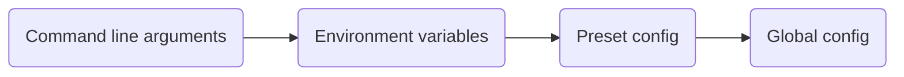

# Randomizer Anywhere

**Randomizer Anywhere** is a successor to [Randomizer TMF](https://github.com/BigBang1112/randomizer-tmf) that brings the Random Map Challenge experience to every TrackMania game (that supports GBXRemote protocol) by spinning up a fully configured dedicated server for you.

Instead of hooking into your local game client, Randomizer Anywhere downloads, configures, and launches a dedicated server, then drives the whole randomizer experience through a few in-game chat commands. This means it works for every player connected to the server, solo or with friends, on your machine or over the network. And on Linux, too!

This project was made to support the [100% TMX Project](https://discord.gg/HRShWnzpK3).

## Supported games

| Game | Dedicated server |
| --- | --- |
| TrackMania Nations Forever (TMNF) | TMF |
| TrackMania United Forever (TMUF) | TMF |
| TrackMania Nations ESWC (TMN) | TM |
| TrackMania Sunrise eXtreme (TMS) | TM |
| TrackMania Original (TMO) | TM |

## Features

- Automatically downloads, configures, and starts the correct dedicated server for your chosen game
- Random map picking powered by [TMX](https://tm-exchange.com/) (tmnf.exchange, tmuf.exchange, nations/sunrise/original tm-exchange.com)
- All TMX randomization filters supported
- Ingame chat commands to control the session without leaving the game
- Configurable session time limit that freezes/resumes correctly across map loads
- Auto skip on Author/Gold/Silver/Bronze medal, or on finish, once a session is active
- Works solo on LAN, or with multiple players on LAN or the Internet (uses server vote-calling for skip/next map)

## Installation

Randomizer Anywhere is a .NET console app. It is still WIP, so no builds are distributed yet.

1. Install the [.NET SDK](https://dotnet.microsoft.com/download) matching the version required by the project.
2. Clone this repository.
3. Run the app from the `RandomizerAnywhere` project folder:

```
dotnet run --project RandomizerAnywhere
```

Once ready, the server becomes available in your game's "Local network" menu.

## Presets

Presets bundle a reusable set of options into a named `.toml` file, handy for sharing curated challenge packs without editing `config.toml` directly.

You can set `Preset = "<name>"` in `config.toml` to activate a certain preset at the start of the app.

The following presets are bundled:

| Preset | Display name | Key features |
| --- | --- | --- |
| `tmnf` | Random Map Challenge (TMNF) | 1 hour time limit, auto-skip on AT |
| `tmuf` | Random Map Challenge (TMUF) | 1 hour time limit, auto-skip on AT |
| `tmn` | Random Map Challenge (TMN) | 1 hour time limit, auto-skip on AT |
| `tms` | Random Map Challenge (TMS) | 1 hour time limit, auto-skip on AT |
| `tmo` | Random Map Challenge (TMO) | 1 hour time limit, auto-skip on AT |
| `100tmx_tmnf` | 100% TMX Project (TMNF) | Unfinished maps, auto-skip on finish |
| `100tmx_tmuf` | 100% TMX Project (TMUF) | Unfinished maps, auto-skip on finish |
| `100tmx_tmn` | 100% TMX Project (TMN ESWC) | Unfinished maps |
| `100tmx_tms` | 100% TMX Project (TMS) | Unfinished maps |
| `100tmx_tmo` | 100% TMX Project (TMO) | Unfinished maps |
| `unbeaten_at_tmnf` | Unbeaten AT Challenge (TMNF) | Unbeaten AT maps, auto-skip on AT |
| `unbeaten_at_tmuf` | Unbeaten AT Challenge (TMUF) | Unbeaten AT maps, auto-skip on AT |
| `unbeaten_at_tmn` | Unbeaten AT Challenge (TMN) | Unbeaten AT maps |
| `unbeaten_at_tms` | Unbeaten AT Challenge (TMS) | Unbeaten AT maps |
| `unbeaten_at_tmo` | Unbeaten AT Challenge (TMO) | Unbeaten AT maps |
| `wirtual_tmnf` | Wirtual Random Map Challenge | Map names with "wirtual", 1 hour time limit |

To create a new preset, add a `<name>.toml` file to the `Presets` folder (see `Presets/100tmx_tmnf.toml` for an example).

## Command line usage

```
RandomizerAnywhere [--game <game>] [--tmx-game <game>] [--tmx-query <query>] [--bind-ip <ip>] [--xmlrpc-port <port>] [--server-name <name>] [--no-server] [--help]
```

| Option | Description |
| --- | --- |
| `--game`, `-g <game>` | Game to set up: `TMNF`, `TMUF`, `TMN`, `TMS`, or `TMO`. Falls back to `Game` in `config.toml`, then prompts interactively if not set. |
| `--tmx-game`, `-t <game>` | TMX site to use, if different from `--game`: `TMNF`, `TMUF`, `TMN`, `TMS`, or `TMO`. |
| `--tmx-query`, `-q <query>` | Raw TMX query string to filter randomized maps, overriding the `TmxQuery` table in `config.toml`, as well as any modification later in the setup. |
| `--bind-ip <ip>` | IP address the dedicated server binds to. |
| `--xmlrpc-port <port>` | Port used for the GBXRemote XML-RPC connection to the dedicated server. |
| `--server-name <name>` | Name shown for the server in the game's server list. |
| `--no-server` | Skip downloading/starting the dedicated server (useful if you already have one running). |
| `--help`, `-h` | Show usage information. |

## Environment variables

Many settings can also be provided through an environment variable, which is useful for containerized or headless setups. Environment variables take priority over `config.toml` but are overridden by command line arguments where an equivalent option exists.

| Variable | Description |
| --- | --- |
| `RANDANY_GAME` | Game to set up: `TMNF`, `TMUF`, `TMN`, `TMS`, or `TMO`. |
| `RANDANY_BIND_IP` | IP address the dedicated server binds to. |
| `RANDANY_XMLRPC_PORT` | Port used for the GBXRemote XML-RPC connection to the dedicated server. |
| `RANDANY_AUTO_SKIP_MODE` | Auto skip trigger: `AuthorMedal`, `GoldMedal`, `SilverMedal`, `BronzeMedal`, `Finished`, or `None`. |
| `RANDANY_NO_SERVER` | Set to `true` to skip downloading/starting the dedicated server. |
| `RANDANY_CALLVOTE_ON_FINISH` | Set to `true` to call a vote to skip/next map once someone finishes, instead of an instant skip. |
| `RANDANY_SERVER_NAME` | Name shown for the server in the game's server list. |
| `RANDANY_GAMESETTINGS` | Path to the match settings file used to configure the dedicated server. |

## Configuration precedence

Settings can come from multiple sources. When the same setting is provided in more than one place, the following order decides which value wins, from highest to lowest priority:



The final configuration state is then written into session data for leaderboard filters.

## In-game chat commands

| Command | Description |
| --- | --- |
| `/start` | Starts a new randomizer session and queues the first random challenge. |
| `/stop`, `/end` | Stops the active session and resets the current challenge. |
| `/skip` | Skips the current challenge for a new random one. |
| `/imp` | Marks the current challenge as impossible so it won't appear again. |
| `/timelimit`, `/tl <seconds>` | Shows or sets the session time limit (only while no session is active). |
| `/preset <name>` | Applies a bundled preset by name (only while no session is active). |
| `/presets` | Lists all available presets. |
| `/commands` | Lists all available chat commands. |

## Special thanks

- To Flink and Greep, for inventing the challenge
- To the TMX maintainers that make this possible!
